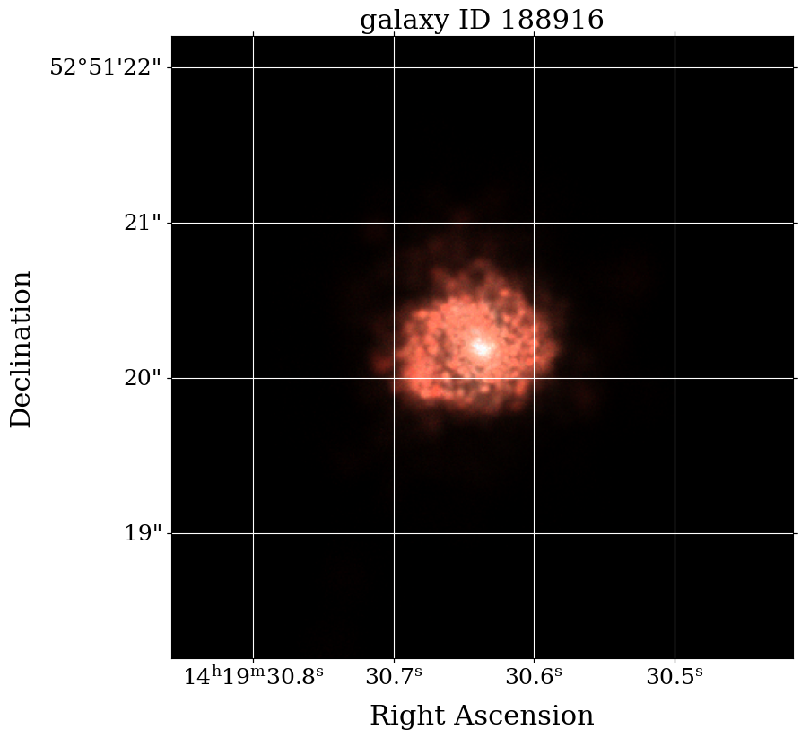

# RGB synthetic images
## Massive galaxies at redshift 3<z<6 from IllustrisTNG50

The TNG50 data release (v1.0) provides a resolved version of IllustrisTNG50 galaxies at an angular resolution of 0.010 arcsec/px. This version can be used to create synthetic RBG images of the galaxies using the python script *tng50_rgb.py*. One example (galaxy ID 188916 at redshift z=3) is provided in this repository.

## Example: 188916

## Data releases

The full set of synthetic images of high-redshift galaxies in IllustrisTNG50 can be downloaded at:

**[TNG project webpage](https://www.tng-project.org/costantin22)**
